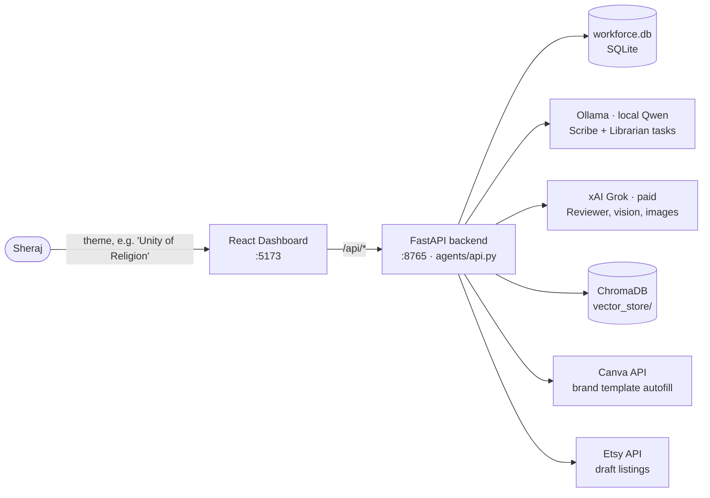
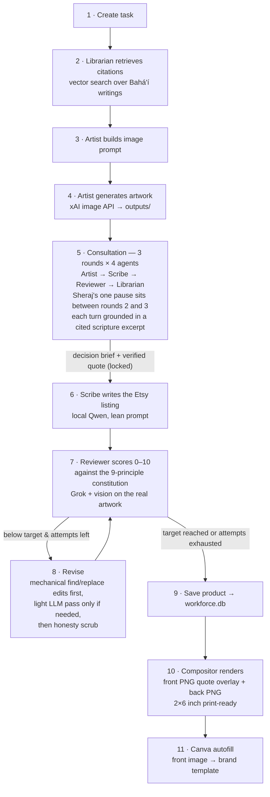
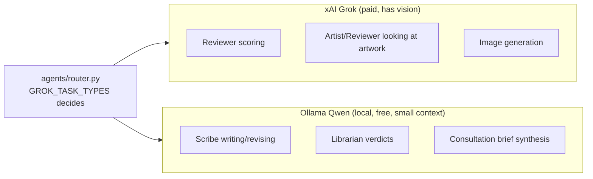
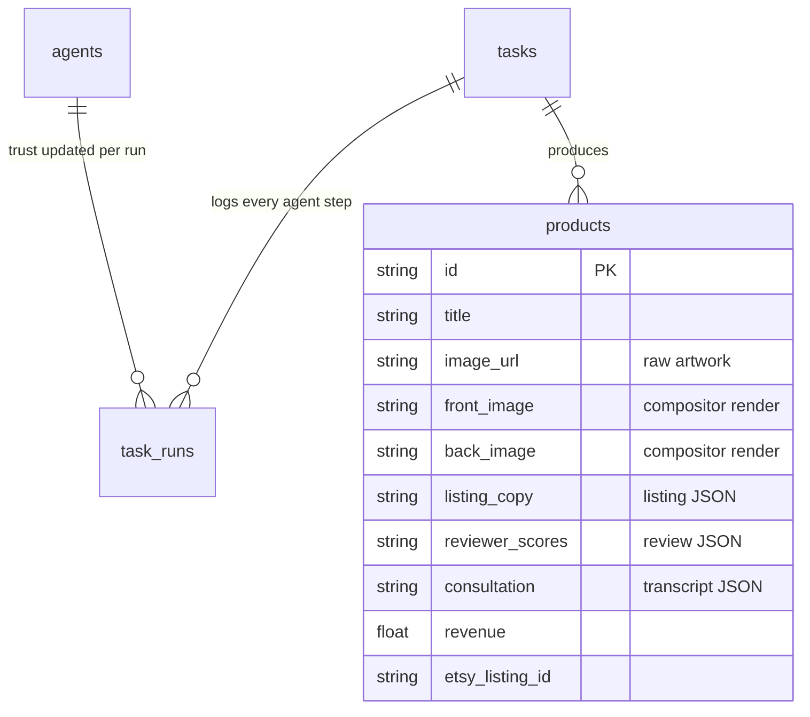

# bahAI Workforce — Architecture

One-page visual + reference for how the app works. (Mermaid diagrams render on
GitHub and in VSCode with a Mermaid extension.)

## The big picture

## The bookmark pipeline (the "Run pipeline" button)

`_run_full_pipeline` in `agents/api.py` — runs as a background job, the
dashboard polls progress.

Key loop invariants (step 7–8): always revise the **latest** listing with the
**latest** review; keep the **best** separately; ties adopt the newer listing;
only strict score regressions count toward the 2-strike stall stop; the
consultation's round-2 decision is binding on the Reviewer (overrides must say
"REOPENING team decision").

At the pause between rounds 2 and 3 (both pipelines — Sheraj is asked exactly
once), the Reviewer's ask-for-input turn carries a **rendered front-face
preview** (`render_preview` callback into `run_consultation` — pure
compositor, no LLM) so Sheraj steers from the actual printed look. For cards
the preview is English-only (translation happens after the pause) and the
message says so. A preview failure skips the image, never blocks the pause.
Round 3 then runs as a full extra four-turn cycle carrying Sheraj's guidance
(if any) into every turn — the team's dialogue keeps going after the human's
review instead of stopping the moment a human has spoken — before the brief
is synthesised.

## The quote-card pipeline (giveaway product line)

`_run_card_pipeline` in `agents/api.py` (`POST /pipeline/run-card`) — parallel
to the bookmark pipeline, never sold, no listing/Etsy. Differences that matter:

- **The printed quote may ONLY come from Ruhi Institute Book 1, "Reflections
  on the Life of the Spirit"** (owner decision, 2026-07) — not the general
  7-text index. `agents/ruhi_book1_source.py` is the curated, hand-transcribed
  list of every quotable passage in that book (67 entries); `scripts/ingest_ruhi_book1.py`
  embeds it into its own ChromaDB collection (`ruhi_book1_quotes`, same
  `vector_store/`, separate from `bahai_texts`); `librarian.retrieve_ruhi_book1()`
  is the only retrieval function the card pipeline may call. If that index
  returns nothing, the card job fails outright — it never falls back to the
  general index, which would silently break the restriction.
- Consultation reuses `run_consultation(product="quote_card")` — same 3-round
  structure (with the same human pause between rounds 2 and 3), card-specific
  framing via `_PRODUCT_FRAMES` (the newcomer to the
  Faith, not the Etsy buyer, is the standard of judgment; shorter quote spec;
  `source_scope` tells the Librarian turn the citations shown are already
  Book-1-restricted and must not be substituted from memory).
- Optional translation (`agents/translator.py`, Grok): Spanish/Mandarin/Arabic;
  the AI-assisted disclaimer is appended IN CODE in the target language and
  printed on the card — never trusted to the LLM.
- `agents/card_compositor.py` renders 3.5″×2″ faces at a true 1050×600px/300dpi
  (front: vignette + English quote + translation + citation + disclaimer;
  back: clean art). Arabic is shaped per line with arabic-reshaper + python-bidi;
  CJK/Arabic fonts come from `translator.LANGUAGES` config.
- The Reviewer scores a purpose-built rubric (`reviewer.score_quote_card`,
  seeing the RENDERED FRONT): quote/citation, translation, artwork fit,
  newcomer accessibility, print legibility. Rather than the Reviewer picking
  the next move alone, `consultation.run_card_revision_consultation` then
  convenes a short group discussion (Artist reacts to the render, Librarian
  proposes an alternative passage if the quote is the weak point, Reviewer
  casts the final call after hearing them) — same "differing opinions"
  discipline as the pre-render consultation, condensed to three turns since
  the card is already scored. The Reviewer's own verdict is the fallback if
  any turn fails. Either way the outcome is the same machine-readable
  `action` ("ship" | "requote" | "repaint") that drives the revision loop
  mechanically — group input informs the call, it never replaces the schema
  the pipeline executes on.
- Storage: same `products` table with `product_type='quote_card'`;
  `listing_copy` holds the card JSON (quote, citation, translation,
  disclaimers). Bookmark-only endpoints (improve/regenerate/publish/manual
  edit) reject cards via `_require_bookmark`.

## Who talks to which model

## Data model (SQLite, `agents/state.py`)

## Dashboard tabs → endpoints

| Tab | Component | Endpoints used |
|---|---|---|
| Pipeline | `PipelinePanel.tsx` | `POST /pipeline/run`, `POST /pipeline/run-card`, `GET /card/languages`, `GET /pipeline/status/{id}`, `GET /pipeline/jobs` |
| Products | `ProductsGallery.tsx` | `GET /products`, `POST /products/{id}/improve`, `PATCH /products/{id}` (manual edit), `POST /products/{id}/revenue`, `POST /etsy/publish`, `GET/POST /products/{id}/layout[/preview]` (visual layout editor, `LayoutEditor.tsx` — see AGENTS.md) |
| Post to X | `XPostsPanel.tsx` | `POST /x-post`, `GET /x-post/pending`, `.../drafts`, `.../posted`, `POST /x-post/approve/{id}`, plus edit/regenerate/discard variants — see `dashboard/src/lib/api.ts` |
| Secretary | `SecretaryPanel.tsx` | `POST /secretary/chat` and the calendar/Gmail/Drive/Docs/Sheets/tasks/reminders/notes/contacts surface — see AGENTS.md's Secretary section and `dashboard/src/lib/api.ts` for the full list |
| Trust | `TrustPanel.tsx` | `GET /trust/report`, `GET /agents` |
| Settings | `SettingsPanel.tsx` | `GET /canva/status`, `GET /etsy/status` |

Images are served from `outputs/` at `GET /outputs/{filename}`.
`POST /canva/autofill` is kept as a manual utility (re-push an image to Canva).

## History note

The system originally ran on n8n workflows calling granular per-agent
endpoints. n8n was abandoned for the custom dashboard (owner decision, 2026-07);
the workflows and their ~16 endpoints were removed in the 2026-07-03 cleanup.
If you need a granular capability back, call the agent module functions
directly — they all still exist (`librarian.retrieve`, `artist.generate_image`,
`scribe.write_listing`, `reviewer.score`, `compositor.render_bookmark_pair`).
