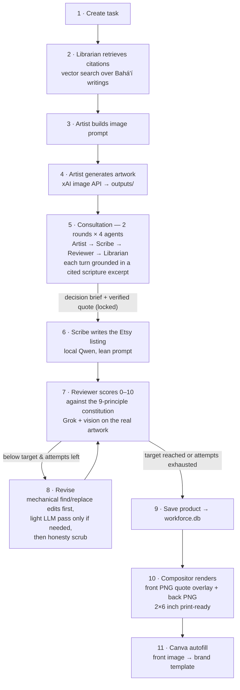
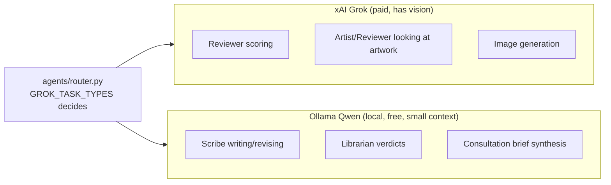
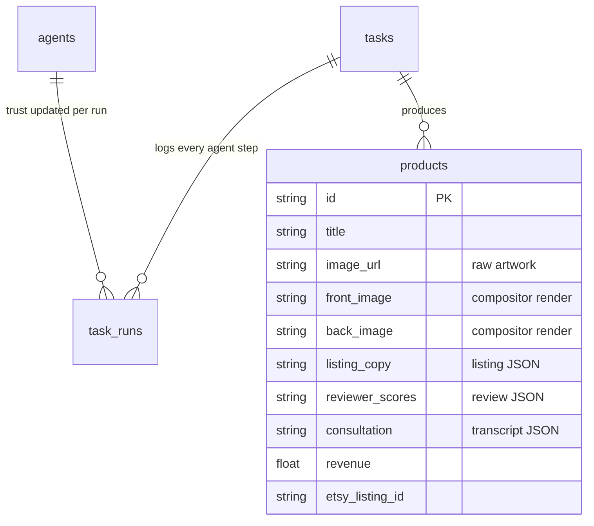

# bahAI Workforce — Architecture

One-page visual + reference for how the app works. (Mermaid diagrams render on
GitHub and in VSCode with a Mermaid extension.)

## The big picture

## The bookmark pipeline (the "Run pipeline" button)

`_run_full_pipeline` in `agents/api.py` — runs as a background job, the
dashboard polls progress.

Key loop invariants (step 7–8): always revise the **latest** listing with the
**latest** review; keep the **best** separately; ties adopt the newer listing;
only strict score regressions count toward the 2-strike stall stop; the
consultation's round-2 decision is binding on the Reviewer (overrides must say
"REOPENING team decision").

## Who talks to which model

## Data model (SQLite, `agents/state.py`)

## Dashboard tabs → endpoints

| Tab | Component | Endpoints used |
|---|---|---|
| Pipeline | `PipelinePanel.tsx` | `POST /pipeline/run`, `GET /pipeline/status/{id}`, `GET /pipeline/jobs` |
| Products | `ProductsGallery.tsx` | `GET /products`, `POST /products/{id}/improve`, `PATCH /products/{id}` (manual edit), `POST /products/{id}/revenue`, `POST /etsy/publish` |
| Trust | `TrustPanel.tsx` | `GET /trust/report`, `GET /agents` |
| Settings | `SettingsPanel.tsx` | `GET /canva/status`, `GET /etsy/status` |

Images are served from `outputs/` at `GET /outputs/{filename}`.
`POST /canva/autofill` is kept as a manual utility (re-push an image to Canva).

## History note

The system originally ran on n8n workflows calling granular per-agent
endpoints. n8n was abandoned for the custom dashboard (owner decision, 2026-07);
the workflows and their ~16 endpoints were removed in the 2026-07-03 cleanup.
If you need a granular capability back, call the agent module functions
directly — they all still exist (`librarian.retrieve`, `artist.generate_image`,
`scribe.write_listing`, `reviewer.score`, `compositor.render_bookmark_pair`).
